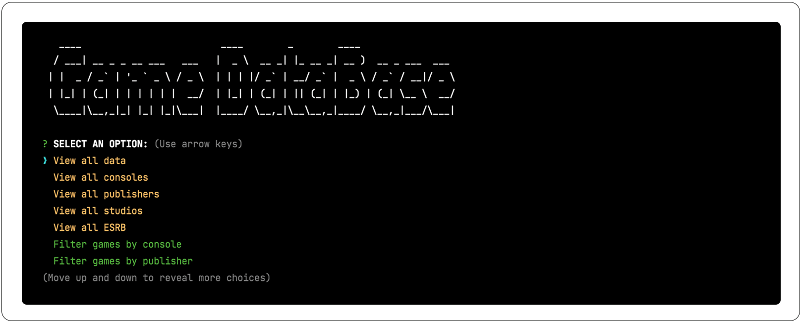

# GAMEDATA
This is a program made to help you organize and keep track of your video games library. The execution is from the CLI 
and the data will be stored as custom database in SQL format.

### Badges
[](https://github.com/ca2los/gamedata/blob/main/LICENSE)
[]()
[]()
[]()

## Install
**IMPORTANT:** To run this program you will need to make sure that MySQL is already installed in your computer as well 
as your password to access the service. For first timers with MySQL, please [**visit**](https://dev.mysql.com/doc/) the 
official website to register and obtain a user and a password.

## Building
This program is build on [**Node JS**](https://nodejs.org/en/download/) and [**NPM technologies**](https://www.npmjs.com/) 
to process the connection and transfer the data. This means that after forking the project, you will need to enter some 
commands to run GAMEDATA. To initialize it, from the terminal access the folder of the project and run the commands 
for installing NPM and run its packages.
```
$ npm install               -> Install NPM inside the project
$ npm run                   -> Runs NPM and the packages already listed inside "package.json"
``` 

**ACCESS MySQL:** Type your user and password account. This process will help you initialize the schema and seed the 
database with examples to help you understand how the program works.
```
$ mysql -u root -p          -> Command to access the MySQL shell
$ Enter password:           -> Now you must enter your password, and won't see the typed characters
$ USE game_db;              -> Acces the database with name of game_db
$ source ./db/schema.sql    -> Finds the file "schema.sql" inside "db" to initialize the table
$ source ./db/seeds.sql     -> Finds the file "seeds.sql" iniside "db" to seed the table
$ exit;                     -> Exit from MySQL shell
```

**NODE JS:** Now the project is ready, and it's time to run the server. At this point, the project has already installed 
the following technologies:

TECH | NAME | DOCS | DESCRIPTION
------------ | ------------- | ------------- | -------------
NODE | NODE JS | [LINK](https://nodejs.org/en/) | Node.js® is a JavaScript runtime built on Chrome's V8 JavaScript engine.
NPM | MySQL2 | [LINK](https://www.npmjs.com/package/mysql2) | MySQL client for Node.js with focus on performance.
NPM | EXPRESS | [LINK](https://www.npmjs.com/package/express) | Fast, un-opinionated, minimalist web framework for node.
NPM | INQUIRER | [LINK](https://www.npmjs.com/package/inquirer) | A collection of common interactive command line user interfaces.
NPM | CONSOLE TABLE | [LINK](https://www.npmjs.com/package/console.table) | Adds console.table method that prints an array of objects as a table in console
NPM | FIGLET | [LINK](https://www.npmjs.com/package/figlet) | Creates ASCII Art from text. A full implementation of the FIGfont spec.
NPM | CHALK | [LINK](https://www.npmjs.com/package/chalk) | Terminal string styling done right.

## Server



## Program